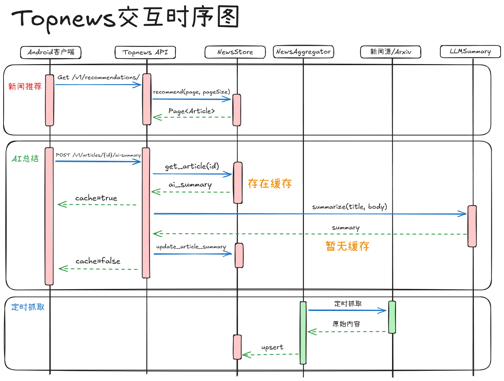

# TopNews

TopNews 是一个 Android 新闻聚合应用，配套 Python 后端服务。客户端负责新闻流展示、分类浏览、详情预览、AI 摘要触发和学术关键词管理；后端负责抓取 RSS、门户新闻和 arXiv 论文，使用 SQLite 存储并对外提供推荐接口。



## 运行结构

- `app/`：Android 客户端，使用 Kotlin、Jetpack Compose、Retrofit 和 Material 3。
- `backend/topnews_backend/`：Python 后端，包含抓取、分类、存储、推荐、AI 摘要和 HTTP API。
- `backend/sources.example.json`：默认新闻源与后端配置示例。
- `gradle/`、`gradlew`、`gradlew.bat`：Android 项目构建所需的 Gradle Wrapper。

## 启动后端

在项目根目录执行：

```powershell
python -m backend.topnews_backend.cli fetch --news-limit 80 --papers-limit 100 --figures-limit 10
python -m backend.topnews_backend.cli serve --host 0.0.0.0 --port 8080
```

常用接口：

```text
GET  /health
GET  /v1/recommendations
GET  /v1/ai-frontier
GET  /v1/papers/recommendations
POST /v1/articles/{external_id}/ai-summary
POST /v1/papers/{external_id}/ai-summary
```

AI 摘要使用 OpenAI 兼容接口，可通过环境变量配置：

```powershell
$env:TOPNEWS_LLM_BASE_URL = "https://api.example.com/v1"
$env:TOPNEWS_LLM_API_KEY = "your-api-key"
$env:TOPNEWS_LLM_MODEL = "your-model-name"
```

## 运行 Android

模拟器默认访问本机后端：

```properties
TOPNEWS_BACKEND_BASE_URL=http://10.0.2.2:8080/
```

真机调试可以在 `local.properties` 中配置局域网后端地址：

```properties
TOPNEWS_BACKEND_LAN_BASE_URL=http://电脑局域网IP:8080/
```

安装 Debug 包：

```powershell
.\gradlew.bat :app:installDebug
```

只构建不安装：

```powershell
.\gradlew.bat :app:assembleDebug
```
